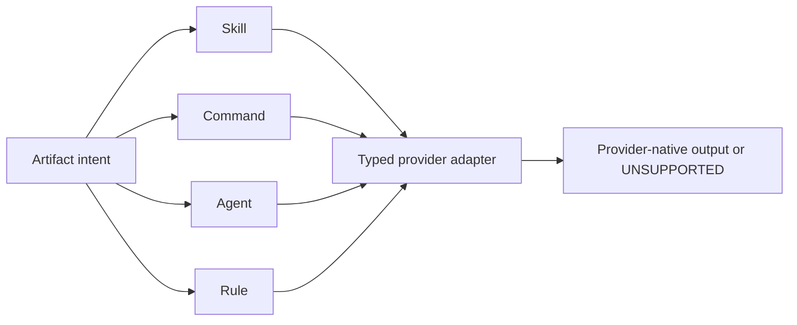

# ADR-0001 — Preserve artifact-type boundaries

- **Status:** Accepted
- **Date:** 2026-08-27
- **Scope:** Canonical authoring, validation, and provider projection of skills, commands, agents, and rules
- **Relates to:** Master v7 artifact and command contracts
- **Supersedes:** Master v6 guidance that allowed command behavior to collapse into skills

## Context

The repository stored explicit slash-command workflows as skills and planned to
remove or convert command sources according to provider implementation details.
This conflated activation, input, size, safety, and evaluation contracts.
Commands may contain long parameterized workflows loaded only on invocation;
skills require compact discovery metadata and may activate automatically.
Rules and agents have different lifecycles again.

Some providers internally share mechanisms for commands and skills, while
others use separate files or provide no custom command surface. Provider storage
does not change the artifact's canonical semantics.

## Decision

Skills, commands, agents, and rules are separate canonical types with distinct
models, validators, evals, budgets, adapters, and destinations. An adapter may
translate representation but cannot change type. Unsupported type/provider
combinations fail explicitly.

### Principles

1. Activation and behavior determine artifact type; filenames and provider
   internals do not.
2. A type correction is atomic: create the correct owner, rewire consumers, and
   remove the wrong owner without aliases or coexistence.
3. Command size policy is independent from skill router/procedure budgets.

## Options considered

| Option | Benefits | Costs and risks | Result |
|---|---|---|---|
| One generic prompt artifact | Minimal model code | Silent semantic loss, unsafe auto-invocation, false token gates | Rejected |
| Represent everything as skills | Broad provider reach | Commands become fake skills; long workflows pollute discovery; unsupported providers appear green | Rejected |
| Preserve canonical types and adapt per provider | Correct activation, validation, and failure behavior | More typed adapter code and tests | Accepted |

## Architecture impact

| Area | Change | Owner | Unchanged boundary |
|---|---|---|---|
| Source models | Separate specs and discovery rules | Governance source | Provider files remain projections |
| Validation | Type-specific schema, budget, eval, and safety gates | Validation/Waza owners | Native project gates remain required |
| Projection | Typed adapter dispatch | Projection owner | Foreign destination content remains foreign |
| Commands | Flat explicit source and independent size policy | `commands/` | Skill discovery remains skill-only |

## Consequences

- **Positive:** Explicit activation, accurate budgets, provider incompatibility
  visibility, and no command pollution in skill context.
- **Negative:** Each supported provider/type pair needs a real adapter and
  runtime canary.
- **Risk:** A generic renderer could reintroduce type collapse; schema and
  projection tests must reject it.

## State of implementation

| Decision part | Status | Durable evidence |
|---|---|---|
| Architecture decision | Accepted | This ADR and master v7 contracts |
| Typed source models/adapters | Partial on work lane | Distinct catalog, command, agent, and rule models/adapters; full projection matrix remains open |
| Command-shaped skill cutover | Implemented on work lane | Every discovered flat command source has one command-native eval suite; integration pending |
