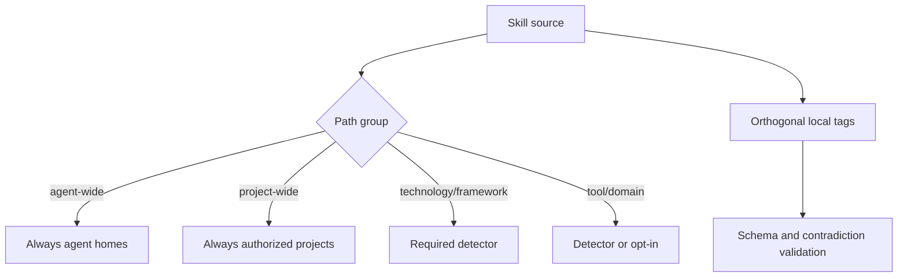

# ADR-0002 — Derive skill distribution from paths and tags

- **Status:** Accepted
- **Date:** 2026-08-27
- **Scope:** Skill source layout, distribution, classification, detection, and discovery
- **Relates to:** Master v7 skill taxonomy
- **Supersedes:** Flat skill source and registry-owned personal/generic/technology classification

## Context

The prior taxonomy mixed orthogonal concepts. `personal` and `generic` described
distribution, while `technology`, `framework`, `tool`, and `domain` described
subject or dependency. Forcing each skill into one balanced bucket produced
arbitrary associations. A separate registry then risked disagreeing with source
paths and frontmatter.

The operator requires one folder whose skills always go to agents, one whose
skills always go to projects, and coherent conditional families. Tags must
catalog overlapping semantics without duplicating skills.

## Decision

Use six source directories: `agent-wide`, `project-wide`, `technology`,
`framework`, `tool`, and `domain`. The first two are unconditional distribution
contracts. The remaining four are conditional primary semantic groups. Local
validated tags express route, activation, detectors, subjects, usage, and risk.
Recursive discovery is authoritative; no registry lists artifact names,
categories, destinations, or activation.

### Principles

1. One skill has one canonical path; multi-axis meaning uses tags.
2. Directory placement follows distribution or primary runtime dependency, not
   a target count.
3. Conditional projection requires project evidence or explicit opt-in.
4. Unknown, contradictory, or detectorless classification fails loudly.

## Options considered

| Option | Benefits | Costs and risks | Result |
|---|---|---|---|
| Flat directory plus JSON registry | Simple paths | Split-brain identity and manual drift | Rejected |
| Subject-only folders | Familiar catalog browsing | Cannot express unconditional distribution without another authority | Rejected |
| Distribution-first wide groups plus conditional semantic groups and tags | Clear projection behavior and multi-axis catalog | Requires recursive discovery and tag validation | Accepted |

## Architecture impact

| Area | Change | Owner | Unchanged boundary |
|---|---|---|---|
| Skill tree | Six recursive groups | `skills/` paths | Bundle-local references remain local |
| Catalog | Generated from discovery | Governance discovery | Generated indexes remain read-only outputs |
| Projection | Route and detector derived from path/tags | Projection owner | Target project evidence remains target-owned |
| Waza | Scenarios discovered recursively | Waza owner | Skill eval semantics remain material |

## Consequences

- **Positive:** Deterministic distribution, coherent browsing, overlapping
  semantic facets, and removal of hand-maintained category registries.
- **Negative:** Existing paths, references, eval IDs, and projections require an
  atomic migration.
- **Risk:** Tags could become an unvalidated second registry; allowed prefixes,
  cardinality, sorting, and path consistency are blocking gates.

## State of implementation

| Decision part | Status | Durable evidence |
|---|---|---|
| Taxonomy and current mapping | Accepted | Master v7 skill taxonomy |
| Recursive discovery and validation | Implemented on work lane | `Catalog` strict recursive path/tag schema and canonical inventory lock |
| Physical migration | Implemented on work lane | 76 canonical bundles under the six source groups; integration pending |
