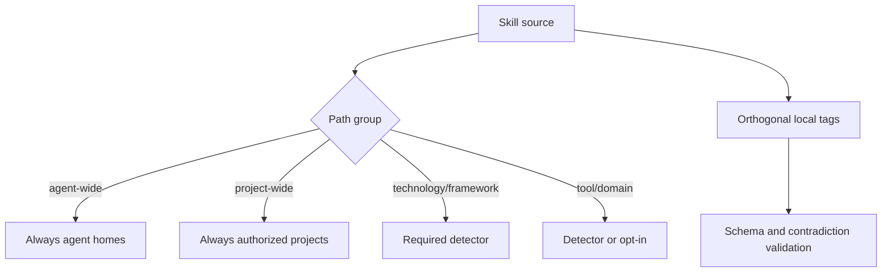

# ADR-0002 — Derive skill distribution from paths and tags

- **Status:** Accepted
- **Date:** 2026-08-27
- **Scope:** Central and authorized project-local skill layout, distribution, classification, detection, and discovery
- **Relates to:** Master v7 skill taxonomy
- **Supersedes:** Flat skill source and registry-owned personal/generic/technology classification

## Context

The prior taxonomy mixed orthogonal concepts. `personal` and `generic` described
distribution, while `technology`, `framework`, `tool`, and `domain` described
subject or dependency. Forcing each skill into one balanced bucket produced
arbitrary associations. A separate registry then risked disagreeing with source
paths and frontmatter.

The operator requires one folder whose skills always go to agents, one whose
skills always go to projects, and coherent conditional families. Tags must
catalog overlapping semantics without duplicating skills.

## Decision

Use six source directories: `agent-wide`, `project-wide`, `technology`,
`framework`, `tool`, and `domain`. The first two are unconditional distribution
contracts. The remaining four are conditional primary semantic groups. Local
validated tags express route, activation, detectors, subjects, usage, and risk.
Recursive discovery is authoritative; no registry lists artifact names,
categories, destinations, or activation.

Reusable sources remain owned only by `agents/skills/`. A physical project may
add a private source under its own `skills/<category>/<slug>/SKILL.md` only after
that same repository's physical `.agents/projection.json` v1 or v2 authorizes project
projection. Absence of authorization means the local tree is not loaded. The
central and local trees are independently writable owners and are composed only
in the immutable publication plan; no merged catalog or copied intermediate
tree becomes an input.

### Project-local source contract

- Local bundles use the central frontmatter, typed-tag, path, budget,
  portability, bundle-resource, and Waza contracts without exception.
- `provenance:project-owned` is required for every local bundle. A local source
  cannot claim `provenance:agents-owned` or another repository's provenance.
- A local `project-wide` bundle is unconditional inside its authorized project.
  Local `technology`, `framework`, `tool`, and `domain` bundles require
  `route:project` and the same detector semantics as central conditional skills.
  Local `agent-wide` and `route:agent` sources are invalid because a project
  owner cannot publish personal reusable capability.
- A local name or source digest that collides with the central catalog fails
  before destination planning. Semantic equivalence that is not byte-identical
  is rejected by the required content review and promoted to the central owner
  when it has more than one consumer.
- The corresponding physical project owns `evals/<slug>/eval.yaml`, fixtures,
  and exactly the material happy-path, fail-closed, and should-not-trigger task
  families. Missing or invalid local evaluation is a source error, not a reason
  to omit the skill.

For the governed distribution increment, the v1 project selector vocabulary is
`flext` and `cosmos-gitops`, connected only through
`detect:selected-tag:flext` and `detect:selected-tag:cosmos-gitops` on their
central owners. Unknown selected values fail. `agents`, `opt_ins`, and every
Beads-related selection remain empty in all 51 consumers.

### Principles

1. One skill has one canonical path; multi-axis meaning uses tags.
2. Directory placement follows distribution or primary runtime dependency, not
   a target count.
3. Project projection itself requires the project-owned
   `.agents/projection.json`; conditional capabilities inside that boundary
   require validated project evidence or explicit opt-in.
4. Physical authorization permits same-project local discovery but never makes
   a local capability reusable or readable from a sibling repository.
5. Unknown, contradictory, colliding, or detectorless classification fails loudly.
6. Installation and detection provide evidence but never select an auxiliary
   capability.

## Options considered

| Option | Benefits | Costs and risks | Result |
|---|---|---|---|
| Flat directory plus JSON registry | Simple paths | Split-brain identity and manual drift | Rejected |
| Subject-only folders | Familiar catalog browsing | Cannot express unconditional distribution without another authority | Rejected |
| Distribution-first wide groups plus conditional semantic groups and tags | Clear projection behavior and multi-axis catalog | Requires recursive discovery and tag validation | Accepted |

## Architecture impact

| Area | Change | Owner | Unchanged boundary |
|---|---|---|---|
| Skill tree | Six recursive groups | `skills/` paths | Bundle-local references remain local |
| Catalog | Central discovery plus authorized same-project discovery | Governance discovery | Generated indexes remain read-only outputs |
| Projection | Route and detector derived from path/tags | Projection owner | Target project evidence and local sources remain target-owned |
| Waza | Central and local scenarios discovered recursively | Waza owner | Skill eval semantics remain material |

## Consequences

- **Positive:** Deterministic distribution, coherent browsing, overlapping
  semantic facets, and removal of hand-maintained category registries.
- **Negative:** Existing paths, references, eval IDs, and projections require an
  atomic migration.
- **Risk:** Tags could become an unvalidated second registry; allowed prefixes,
  cardinality, sorting, and path consistency are blocking gates.
- **Risk:** A project-local source could hide a second reusable owner; central
  name/digest collision gates and semantic review block publication.

## State of implementation

| Decision part | Status | Durable evidence |
|---|---|---|
| Taxonomy and current mapping | Accepted | Master v7 skill taxonomy |
| Recursive discovery and validation | Implemented on work lane | `Catalog` strict recursive path/tag schema and canonical inventory lock |
| Physical migration | Implemented on work lane | Migration baseline plus every later authorized bundle under the six source groups; current total derived from discovery and the inventory lock; integration pending |
| Project-local contract | Accepted for governed distribution | This ADR and the successor distribution plan; runtime implementation and landing remain required |
