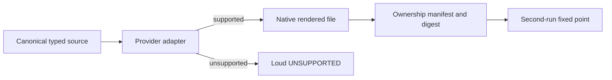

# ADR-0003 — Render provider-native physical projections

- **Status:** Accepted
- **Date:** 2026-08-27
- **Scope:** Projection ownership, provider adapters, destination safety, and fixed-point behavior
- **Relates to:** ADR-0001, ADR-0002, master v7 projection contract
- **Supersedes:** Generic byte-copy projection and symlink/cross-repository distribution concepts

## Context

Providers use different source formats, destinations, arguments, metadata, and
supported artifact types. Copying one generic Markdown file everywhere can
produce invalid, unsafe, or silently ignored output. Symlinks and
cross-repository references couple runtime behavior to a foreign checkout and
violate independent project reconstruction.

Destinations also contain foreign plugin/user content that this repository does
not own. Cleanup based only on filename can destroy unrelated data.

## Decision

Canonical typed sources are rendered through provider-specific adapters into
independent physical files. Every managed output is attributable through a
generated ownership manifest and source digest. Unsupported combinations fail
explicitly. Apply preserves non-conflicting foreign physical content without
adopting it, rejects collisions, symlinks, and modified managed content, and
must reach a fixed point on the second unchanged run.

The public apply is `agentsctl sync`. It accepts no option and derives the
invocation directory's physical Git identity and the current process home.
Invoking the verb selects personal projection. A physical project-owned
`.agents/projection.json` additionally authorizes tracked project projection
and same-project local skill discovery; absence produces zero project output
and loads no local source. The owner validates central and local catalogs and
their evaluations completely, composes sources only in memory, plans every
selected surface, stages on each destination filesystem, and publishes all
selected targets as one transaction. Failure rolls back only effects created by
that invocation and re-raises the first cause.

A root clone owns a physical `.git/` directory. A Git-native submodule may use a
gitfile only when Git proves its superproject and its resolved gitdir is
physically contained under that same umbrella clone's `.git/modules/`
hierarchy. Owned worktree gitfiles are valid, including in `/tmp`; symlinks,
malformed gitfiles, external gitdirs, path escapes, and cross-root references
remain invalid. Authorization, local
source, cwd, and every project destination must be contained in the selected
member worktree.

Generated manifests preserve source truth: central bundles use
`agents:skills`; authorized local bundles use `project:skills`. The origin is
not inferred from a destination path, and a projection never becomes canonical
input.

### Same-project primary and alias skill surfaces

Operator decision (2026-09-02): within one authorized physical project, when
multiple provider skill surfaces receive the same project skill set, exactly
one primary surface is elected — the candidate destination with the most
providers, declaration order breaking ties — and keeps physical copies. The
remaining sibling surfaces become relative symlinks into that primary, always
resolving inside the same project. Personal homes keep independent physical
copies. Cross-repository symlinks, absolute link targets, and links escaping
the project remain forbidden; the ownership manifest records the alias target
per entry and alias drift fails loud.

### Principles

1. Projection is a deterministic function of one canonical typed source and an
   explicit provider capability contract.
2. Destination files are independent physical copies; no symlink, cross-repo
   include, absolute source lookup, or path dependency. Exception: inside one
   physical project, sibling skill surfaces may be relative aliases of the
   elected primary skill surface.
3. Cleanup is ownership-proven and fail-closed.
4. Semantic equivalence matters; byte equality across incompatible provider
   formats does not.
5. One invocation publishes every selected personal and project surface; local
   discovery cannot create a partial provider result.

## Options considered

| Option | Benefits | Costs and risks | Result |
|---|---|---|---|
| Symlink provider roots to the source | Minimal copies | Cross-repo coupling, broken portability, unsafe shared mutation | Rejected |
| Copy the same Markdown everywhere | Simple implementation | Invalid formats, ignored metadata, fake support | Rejected |
| Typed provider adapters plus physical outputs | Correct native behavior and explicit support matrix | Adapter/runtime testing per provider | Accepted |

## Architecture impact

| Area | Change | Owner | Unchanged boundary |
|---|---|---|---|
| Rendering | Provider-specific typed adapters | Projection subsystem | Source semantics remain canonical |
| Storage | One physical copy primitive and destination-local staging | Storage/projection owners | Provider loads its normal path |
| Cleanup | Manifest-proven managed outputs only | Projection subsystem | Foreign/unknown files remain preserved |
| Validation | Syntax, capability, runtime canary, fixed point | Adapter and Waza gates | Provider outages remain red external evidence |
| Authorization | Physical project selection file | Project owner | Installation, remote, or forge access grants no write authority |
| Local sources | In-memory composition after complete validation | Catalog/projection owners | Central and project trees remain independent owners |
| Git identity | Physical root, contained native submodule, or owned Git worktree, including in `/tmp` | Projection owner plus Git evidence | Symlinks, malformed gitfiles, and external gitdirs remain forbidden |

## Consequences

- **Positive:** Portable destinations, accurate provider behavior, safe foreign
  content preservation, and observable unsupported surfaces.
- **Negative:** More rendering and runtime fixtures than a generic copy loop.
- **Risk:** A stale ownership manifest could delete the wrong file; digest,
  source-type, destination, local-modification, symlink, and unknown-content
  checks must all pass before removal.
- **Risk:** Treating every gitfile as a submodule would admit worktrees or
  external storage; Git identity and containment are blocking preflight.

## State of implementation

| Decision part | Status | Durable evidence |
|---|---|---|
| Projection architecture | Accepted | This ADR and master v7 contracts |
| Typed adapters and ownership manifest | Implemented on work lane | Schema v6, project/context/surface/provider/selection ownership, source/physical digests, link targets, and activation evidence |
| Full projection fixed point | Not evidenced | Master v7 Phase 5 |
| Physical root cutover | Future increment | Explicitly excluded from the current repository cutover |
| Local composition and contained submodules | Accepted for governed distribution | This ADR and successor plan; implementation and runtime proof remain required |
