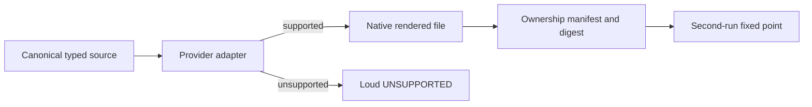

# ADR-0003 — Render provider-native physical projections

- **Status:** Accepted
- **Date:** 2026-08-27
- **Scope:** Projection ownership, provider adapters, destination safety, and fixed-point behavior
- **Relates to:** ADR-0001, ADR-0002, master v7 projection contract
- **Supersedes:** Generic byte-copy projection and symlink/cross-repository distribution concepts

## Context

Providers use different source formats, destinations, arguments, metadata, and
supported artifact types. Copying one generic Markdown file everywhere can
produce invalid, unsafe, or silently ignored output. Symlinks and
cross-repository references couple runtime behavior to a foreign checkout and
violate independent project reconstruction.

Destinations also contain foreign plugin/user content that this repository does
not own. Cleanup based only on filename can destroy unrelated data.

## Decision

Canonical typed sources are rendered through provider-specific adapters into
independent physical files. Every managed output is attributable through a
generated ownership manifest and source digest. Unsupported combinations fail
explicitly. Apply preserves foreign or ambiguous content and must reach a fixed
point on the second unchanged run.

The public apply is `agentsctl sync`. It accepts no option and derives its only
target from the invocation directory's nearest physical `.git/` ancestor. It
plans every supported project surface before the first publication, stages on
the destination filesystem, publishes every changed root as one transaction,
and rolls earlier roots back if a later publication fails. Personal homes are
not part of this verb.

### Principles

1. Projection is a deterministic function of one canonical typed source and an
   explicit provider capability contract.
2. Destination files are independent physical copies; no symlink, cross-repo
   include, absolute source lookup, or path dependency.
3. Cleanup is ownership-proven and fail-closed.
4. Semantic equivalence matters; byte equality across incompatible provider
   formats does not.

## Options considered

| Option | Benefits | Costs and risks | Result |
|---|---|---|---|
| Symlink provider roots to the source | Minimal copies | Cross-repo coupling, broken portability, unsafe shared mutation | Rejected |
| Copy the same Markdown everywhere | Simple implementation | Invalid formats, ignored metadata, fake support | Rejected |
| Typed provider adapters plus physical outputs | Correct native behavior and explicit support matrix | Adapter/runtime testing per provider | Accepted |

## Architecture impact

| Area | Change | Owner | Unchanged boundary |
|---|---|---|---|
| Rendering | Provider-specific typed adapters | Projection subsystem | Source semantics remain canonical |
| Storage | One physical copy primitive and destination-local staging | Storage/projection owners | Provider loads its normal path |
| Cleanup | Manifest-proven managed outputs only | Projection subsystem | Foreign/unknown files remain preserved |
| Validation | Syntax, capability, runtime canary, fixed point | Adapter and Waza gates | Provider outages remain red external evidence |

## Consequences

- **Positive:** Portable destinations, accurate provider behavior, safe foreign
  content preservation, and observable unsupported surfaces.
- **Negative:** More rendering and runtime fixtures than a generic copy loop.
- **Risk:** A stale ownership manifest could delete the wrong file; digest,
  source-type, destination, local-modification, symlink, and unknown-content
  checks must all pass before removal.

## State of implementation

| Decision part | Status | Durable evidence |
|---|---|---|
| Projection architecture | Accepted | This ADR and master v7 contracts |
| Typed adapters and ownership manifest | Implemented on work lane | Schema v4, project/context/surface/provider/selection ownership, source/physical digests, and activation evidence |
| Full projection fixed point | Not evidenced | Master v7 Phase 5 |
| Physical root cutover | Future increment | Explicitly excluded from the current repository cutover |
