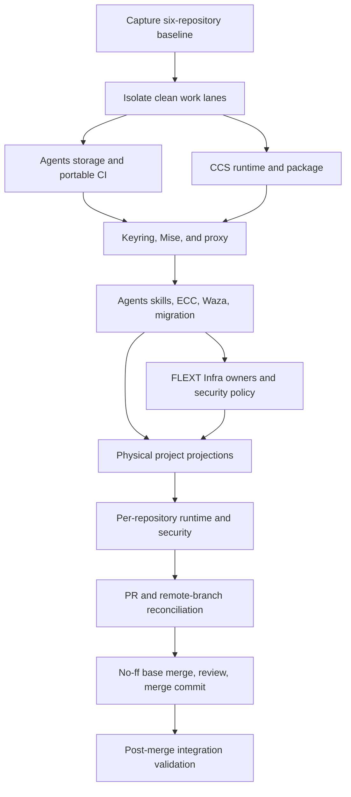

# Execution graph

## Dependency graph

## Global phase order

### Phase 0 — Baseline

- Re-query PRs, reviews, checks, branches, worktrees, merge bases, and dirty
  state.
- Measure storage and identify live owners.
- Append one baseline event per repository to the ledger.

Exit: every repository has a `work-id`, known integration branch, exact dirty
inventory, and no unresolved ownership ambiguity.

### Phase 1 — Isolation

- Keep the clean `.agents` PR branch and the existing CCS crew lane.
- Create repository-local worktrees for AI Hub, Cosmos Docgen, Invest, and
  FLEXT Infra.
- Absorb only attributable WIP and commits.

Exit: isolated lane builds its unmodified base and dirty primary checkouts are
unchanged.

### Phase 2 — Foundations

- Agents owns portable storage configuration, bounded temp execution, catalog,
  Waza model projection, and projection interfaces.
- CCS owns proxy/runtime corrections.
- Keyring migration runs only after CCS representative runtime is available.

Exit: offline CI is portable; keyring and proxy runtime pass without revealing
secrets.

### Phase 3 — Semantic governance

- Repair all 228 Waza scenarios and PR #4 review classes.
- Finish ECC/SkillShare removal, generic skills, strict migration, and
  auto-learning manual mode.
- Run all scenarios before downstream projection.

Exit: 76 skills, 228 meaningful scenarios, no false-green grader, and zero open
PR #4 thread.

### Phase 4 — Owners and propagation

- Land FLEXT Infra generator/security owners.
- Project physical generic/technology/FLEXT skills into the six repositories.
- Run apply twice and prove fixed point.

Exit: personal and project destinations satisfy the distribution matrix.

### Phase 5 — Security and repository repair

- Execute runtime first, then the complete scanner matrix.
- Fix findings at owners, regenerate consumers, and converge lockfiles.
- Reconcile every open PR and remote branch using the deterministic rules in
  each runbook.

Exit: no real finding, omitted manifest, unexplained warning, unresolved PR, or
uncertain branch.

### Phase 6 — Landing

- Merge the current integration base into each work branch with `--no-ff` when
  divergent.
- Re-run runtime and gates, push normally, resolve review, and merge by merge
  commit.
- Validate a detached worktree at the resulting integration SHA.
- Remove only clean and reachable lanes.

Exit: all six integration branches contain the approved changes and pass
post-merge validation.

## Cross-repository ordering

1. CCS runtime repair and installable local package.
2. Agents storage/keyring/Waza/skill authority and PR #4.
3. FLEXT Infra generator and dependency-policy owners.
4. AI Hub, Cosmos Docgen, Invest, and CCS generated/project consumers.
5. Open PR and branch reconciliation in every repository.
6. Post-merge validation of all integration branches.

Do not propagate from an unmerged or unvalidated owner. A consumer PR may be
prepared early, but its final regeneration and validation must use the exact
owner commit selected for landing.

