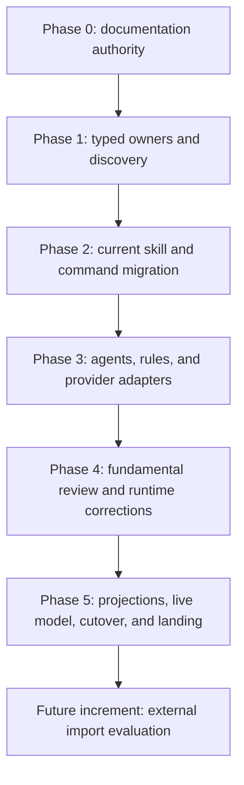

# Execution phases

## Dependency graph

No phase may begin while its predecessor has an unresolved contract, red scoped
runtime, red required gate, or unintegrated owner change. External import is not
part of this graph's implementation increment.

## Phase 0 — Documentation authority

1. Replace master v6 with this single master v7 package.
2. Record artifact boundaries, taxonomy, exact current migration map, tags,
   provider adapters, phases, gates, and failure behavior.
3. Accept ADRs for type boundaries, path/tag taxonomy, and physical
   provider-native projections.
4. Remove deferred multi-repository runbooks and stale instructions that imply
   commands become skills or external import occurs now.
5. Run link, contradiction, terminology, and Markdown gates.

Exit: one active, self-contained plan exists under `docs/execution/master-v7/`;
all later changes can be judged against it. Documentation integration is still
subject to the repository landing contract.

## Phase 1 — Typed owners and recursive discovery

1. Introduce distinct `SkillSpec`, `CommandSpec`, `AgentSpec`, and `RuleSpec`
   models and typed adapter inputs.
2. Replace flat `skills/*/SKILL.md` assumptions with recursive discovery.
3. Derive category and distribution from path plus validated local tags.
4. Remove artifact name/category/destination lists from `config/skills.json` and
   equivalent registries. Keep only provider capability and policy settings.
5. Generate read-only indexes/ownership manifests and prove two-run convergence.
6. Update Waza, Make, validation, normalization, and projection discovery without
   moving artifacts yet.

Exit: current flat sources are discovered through a temporary input adapter, all
85 skills and the command are classified against the migration map, and an
unknown or contradictory artifact fails loudly.

## Phase 2 — Existing skills and commands

1. Create the six skill group directories and move retained bundles according
   to the exact map.
2. Apply the seven atomic renames and rewire every current reference.
3. Convert the six command-shaped skills to canonical flat commands.
4. Absorb unique behavior from the three removed skills into existing owners,
   then delete the duplicates.
5. Rewrite descriptions as short discriminating sentences and normalize local
   tags without changing behavior.
6. Generalize `doc-drift`; keep Gas City-specific behavior only in its explicit
   owner.
7. Remove broken/stale projections, imported identities, command-as-skill
   routes, and all references to old slugs/paths.
8. Run skill and command semantic evals, token gates, contradiction search, and
   fixed-point checks.

Exit: recursive discovery returns exactly the mapped 76 skills and seven
commands from their canonical surfaces; counts result from the map, with no
external addition.

## Phase 3 — Agents, rules, and provider adapters

1. Move agents into `agent-wide` or `project-wide` by actual execution contract.
2. Rename `marketing-agent`, consolidate/remove approved duplicate families,
   and fail on unresolved overlaps instead of forcing a target count.
3. Remove duplicated universal policy from agents and compose it through rule
   adapters.
4. Implement provider-native adapters separately for skills, commands, agents,
   and rules.
5. Make unsupported provider/type combinations explicit and preserve foreign
   destination content.
6. Expand Waza with provider render, activation, collision, injection,
   delegation, and should-not-trigger coverage.

Exit: every current artifact has one canonical source and each supported
provider receives a semantically equivalent physical projection. Unsupported
surfaces are loud and no fake artifact is created.

## Phase 4 — Fundamental corrections

Resolve the accepted review defects at their owners:

1. CI runs for PRs targeting `dev` and for code, tests, Make, config, governance,
   workflow, and generator changes.
2. `agentsctl temp run` owns a process group and terminates that group on
   SIGINT/SIGTERM without touching external processes.
3. Skill and command policies use compatible BPE token counting, with separate
   budgets.
4. Normalization refuses every artifact whose update policy is `forbidden`.
5. MCP check compares fresh generated output and live destinations and exits
   nonzero on either drift.
6. Unknown project targets fail instead of producing an empty green result.

Complete the related root contracts:

- per-run scratch plus exclusive `TMPDIR`, `GOTMPDIR`, and `GOCACHE`;
- shared `GOMODCACHE` and XDG reusable caches/state;
- GC dry-run by default and fail-closed preservation rules;
- Bash, Zsh, Fish, and subprocess equivalence;
- two canonical physical secrets with memory-only aliases;
- deterministic manifest inventory and all applicable security scanners;
- no skip, suppression, fallback, hardcode, omitted project, or accepted risk.

Exit: representative runtime precedes and passes the complete native gates;
every accepted defect has a regression test and global same-class search.

## Phase 5 — Projection, live model, root cutover, and landing

1. Apply all supported personal and isolated-project projections, validate the
   distribution matrix, then apply again and prove fixed point.
2. Run complete offline Waza, command, agent, rule, static, test, build,
   security, storage, and projection gates.
3. Only then select exact `aihub-primary` through the single model owner and run
   live Waza. Auth, quota, HTTP 402, timeout, grader, and model failures remain
   red and cannot select another model.
4. Complete review and merge-commit landing into the configured integration
   branch after current integration is merged into the work lane with
   `--no-ff` when divergent.
5. Validate runtime and complete gates on the resulting integration merge SHA.
6. In a separately controlled window with no live user of the old checkout,
   move the source owner from `~/.agents` to `~/agents`, rewire consumers, and
   validate that the old path and all compatibility routes are absent.
7. Land and post-merge-validate the root cutover through the same contract.

Exit: implementation is merged and verified on integration, projections are at
fixed point, no increment branch/projection residue remains, and the old source
path is absent. State is `LANDED_VERIFIED` while tracker closure is suspended.

## Future external-import increment

Only after Phase 5 may a new reviewed plan consider external provider sources.
It must inventory current capability first, reject duplicates, verify license
and provenance, audit scripts and prompt injection, translate through the same
semantic contracts, add Waza evidence, and adopt physical content locally.
SkillShare and ECC synchronization remain prohibited; the future increment may
extract useful behavior but cannot keep a foreign updater or identity.
