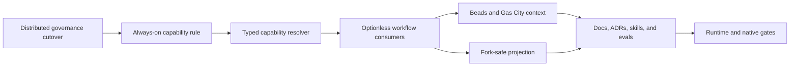

# Additive capability composition plan

- **Status:** Approved
- **Design:** `config/governance.json`, canonical `rules/`, and the typed projection owners
- **ADR:** ADR-0005, reconciled in this increment
- **Owner:** agents governance runtime
- **Work item:** canonical tracker suspended; no substitute ledger; authorized Git/PR/CI evidence only

## Objective

Make the project's native workflow the permanent baseline while treating
projection, Beads, Gas City, provider-live validation, and auxiliary scanners as
independently selected additive capabilities. Absence before selection is a
typed non-target. Invalid or unavailable state after selection stops that whole
workflow before effects, with the original exception and no fallback.

## Accepted predecessor boundary

This plan starts from the completed distributed-governance cutover, composed
from:

- a short `AGENTS.md` bootstrap;
- always-on rules and routed skills;
- `config/governance.json` as the typed composition map;
- a generated governance capsule and provider-native hook projections;
- exactly eight optionless `agentsctl` verbs;
- atomic personal-plus-authorized-current-project publication owned by
  `agentsctl sync`.

The predecessor keeps ownership of unfinished Core residue, hook adapters,
capsule generation, and its focused gates. This plan continuously absorbs those
changes, preserves their intent, and adds no parallel owner or public CLI.

## Capability contract

An effective capability is the intersection of three independently evidenced
facts:

1. the project authorizes it;
2. the operator or invoked workflow selects it;
3. the current host proves its selected prerequisites.

Installation never selects a capability. A canonical calculated default is an
owned input, not fallback. Only non-derivable current external values are
required. A non-selected capability is not loaded, probed, warned, skipped, or
treated as a closure requirement. Once selected, missing authorization,
conflicting configuration, missing readiness, child failure, timeout, signal,
or incomplete publication terminates the invocation.

## Dependencies

## Phases

### Phase 0 — Accept and preserve the concurrent cutover

- Verify every semantic guarantee resolves to an owner, the
  capsule derives from the typed map, and focused governance/projection/hook
  tests pass.
- Re-read every shared owner immediately before editing and preserve all
  compatible concurrent changes by fix-forward.
- Do not run Git, Beads, Dolt, Gas Town, or Gas City while their active
  authority remains suspended.

**Exit condition:** distributed owners are usable and no successor edit
duplicates an unfinished predecessor responsibility.

### Phase 1 — Own additive capability semantics

- Add one always-on rule for authorization, selection, readiness, typed absence,
  workflow-local failure, calculated defaults, and applicable closure gates.
- Add the rule to the typed governance bootstrap so session capsules and static
  provider instructions inherit it without copying prose.
- Add observable RED tests before the owner and prove capsule propagation after
  implementation.

**Exit condition:** exactly one normative owner and no semantic opposite in
active rules.

### Phase 2 — Resolve capabilities once

- Split the existing runtime inventory so each current runtime consumer loads
  one immutable selected capability decision: projection, provider-live
  validation, or configured auxiliary scanners. Beads and Gas City remain
  suspended rule/skill/config contracts and are not loaded by the runtime.
- Compose project authorization, explicit selection, and host readiness before
  effects. Do not probe dormant capabilities.
- Reuse current config/projection owners; add no registry, compatibility reader,
  plugin framework, hidden CLI mode, or redundant environment input.

**Exit condition:** every workflow consumes the same typed decisions and invalid
selected input raises at the first defect.

### Phase 3 — Apply through the eight optionless verbs

- Preserve `help`, `doctor`, `check`, `sync`, `evaluate`, `secure`, `clean`, and
  `live` as the complete public grammar.
- Keep `sync` personal plus current project. Its invocation selects projection;
  project-tracked effects additionally require project authorization.
- Plan every selected destination, preserve foreign content, and publish all
  selected targets transactionally. A second unchanged call is byte-identical.
- Keep Make as development support and gate composition only.

**Exit condition:** no flag, selector, wrapper, alternate command, partial
publication, or second runtime facade exists.

### Phase 4 — Separate direct, Beads, and Gas City behavior

- Direct projects use only their native toolchain.
- Selected standalone Beads uses only the restored runtime owner's current
  project contract. No generic prime hook, generated help block, installation,
  or detection grants selection or Git authority.
- Selected Gas City uses its pinned Pack V2 and declared store. Without Beads,
  no Beads command, hook, issue, or closure gate applies. When both are selected,
  Gas City owns orchestration and Beads owns durable tracking and closure.
- Runtime loss after workflow start stops that workflow. It never degrades to
  direct execution, another store, queue, retry, or substitute tracker.
- Runtime suspension permits static schema and rendering proof only; no
  suspended command is invoked or claimed green.

**Exit condition:** each selected context has one operational facade and one
context owner, while unselected integrations impose no project gate.

### Phase 5 — Protect forks and heterogeneous hosts

- Personal projection remains selected by `sync`; tracked project projection
  requires project authorization and otherwise produces zero project output.
- Preserve foreign files and hooks byte for byte. Remote names, forge APIs,
  network access, installed tools, and another host's configuration never grant
  write authority.
- A required failure outside a contribution's authorized scope stops for an
  operator decision before patch expansion.
- Derive physical project, home, and XDG paths from their owners; never copy one
  user's or host's values to another.

**Exit condition:** a fork without project opt-in receives no tracked governance
changes and still runs its native development workflow.

### Phase 6 — Reconcile the instruction system

- Extend the existing ADR-0005 composed-governance decision with the additive
  model and reconcile ADR-0002 distribution, ADR-0003 projections, and ADR-0004
  CLI semantics.
- Update only skills that decide capability applicability, configuration,
  failure, lifecycle, tracker/orchestration, governance, or closure. Every other
  skill inherits the always-on rule through distributed governance.
- Update each changed skill's three-role Waza suite atomically and add
  cross-skill scenarios for absent, selected-failing, fork, tracker, and
  integration-change behavior.
- Update guides by audience and link to owners instead of copying schemas,
  commands, matrices, or rules.

**Exit condition:** zero active contradiction across rules, skills, evals, ADRs,
docs, templates, prompts, and generated provider instructions.

### Phase 7 — Regenerate and verify

- Regenerate manifests, provider projections, governance capsule, docs, and the
  skill inventory lock through their owners; a second generation changes
  nothing.
- Run focused runtime checks, then every native offline gate. A host or fork
  without Cliproxy credentials remains able to contribute and run offline CI;
  that absence never selects a fallback or yields live evidence.
- When its external token is present and the live workflow is selected, run the
  complete Cliproxy-backed `agentsctl live` corpus. Otherwise record it as `NOT
  EXECUTED`; it provides no live evidence and does not block landing. Never
  reinterpret that exclusion as green or convert a failure after invocation
  into an exclusion.
- When tracker/orchestration runtimes are restored, run standalone Beads, one
  Gas City rig, fork without opt-in, fork with opt-in, and outage canaries.

**Exit condition:** applicable runtime and every offline gate are green with
zero removed-contract residue; each excluded external-token workflow is `NOT
EXECUTED`. Authorized Git/PR integration must complete; `DONE` remains
unavailable until tracker closure exists.

## Test skeletons

| Level | Planned path | Behavior covered |
|---|---|---|
| Unit | governance and capability tests | authorization × selection × readiness |
| Integration | runtime/projection tests | optionless verbs, personal + project, atomicity |
| Semantic | Waza suites | activation, fail-closed, and non-activation |
| End to end | public CLI and native Make gates | real consumer, fixed point, zero residue |

## Verification summary

- **Correctness:** typed state matrix plus raw first-failure and zero-effect
  assertions.
- **Early proof:** the always-on rule appears once in the governance bootstrap
  and generated capsule.
- **Final proof:** applicable runtime, complete applicable native gates,
  fixed-point projections, contradiction search, reviewed integration SHA, and
  tracker closure when restored.
