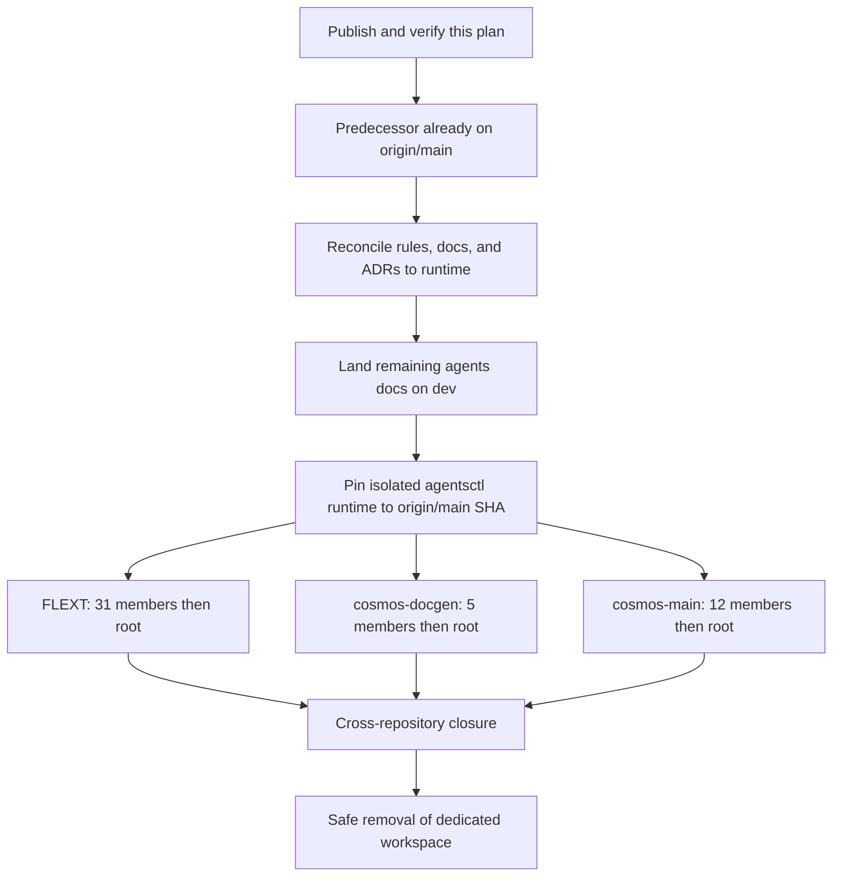

# Governed project skill distribution plan

- **Status:** Approved; predecessor landed on `origin/main`; consumer distribution remains open
- **Operator decision:** 2026-08-28 multi-repository skill synchronization and semantic-fusion correction
- **Observed central base:** fetch and re-prove the then-current `origin/main` SHA; predecessor runtime (authorization v2, worktrees outside `/tmp`) already landed via PRs #40–#43
- **Design authority:** `ADR-0002` (doc file), `ADR-0003` (doc file), `ADR-0004` (doc file), this plan, and the Phase 1 decision updates
- **Owner:** `agents` governance catalog and runtime
- **Work item:** canonical tracker suspended; no substitute tracker or ledger; Git, PR, review, checks, and CI are the only execution evidence

## Objective

Make `agents` the only owner of reusable skills, admit project-local skills only
for behavior that is genuinely private to one project, and distribute the
result through one transactional `agentsctl sync` invocation in each authorized
physical repository.

Migration is semantic, not mechanical. Every source bundle is read in full,
classified by behavior, compared with current rules and catalog owners, and
either fused, recategorized, retained locally, split across the correct artifact
types, rejected as invalid, or removed as proven duplication. File names,
directories, wording similarity, historical category, and desired catalog
counts never decide disposition.

The increment covers 52 repositories: the central `agents` owner and 51
consumers composed of three umbrellas plus their 48 members. The count is an
operator-provided scope expectation, not a registry. The dedicated clones and
their `.gitmodules` files must derive and prove the actual roster before the
first consumer effect; any mismatch stops for operator adjudication.

## Decision boundary

This is a successor to the current master v7 inventory cutover. The master v7
prohibition on external imports remains correct for its own increment. This
plan authorizes the later FLEXT and Cosmos import/distribution increment only
after the complete central predecessor is reachable from, running on, and green
at the then-current `origin/main` SHA.

The new authority does not authorize Gas City, Gas Town, Beads, or Dolt. Those
runtimes remain suspended and must not be invoked, inspected, started, or
replaced. No Markdown status table, database, issue list, spreadsheet, or local
file may act as a substitute tracker or ledger. This plan specifies work; it
does not store rollout state.

On 2026-08-28 the operator confirmed their Datacosmos affiliation, identified
in that authorization as `marlonc-costa-dc`, and expressly authorized this
increment to clone and store the scoped Datacosmos repositories, inspect and
semantically transform their complete skill content, publish the reusable
derived behavior in `agents`, and distribute the governed result to the 51
consumers. This authorization is limited to `cosmos-docgen`, `cosmos-main`,
their members declared by the fetched umbrellas, and the central/family landing
described here. It does not authorize unrelated Datacosmos repositories,
wholesale republication of confidential source text, or a broader license
grant. The PR records source SHA and semantic disposition without copying the
source corpus into a tracker or evidence archive.

The operator has fixed these decisions:

- execute in the operator's declared physical checkouts — one Git repository
  per path directly under the home directory — and create no additional clone,
  worktree, bind mount, or alternate checkout for this increment; a checkout
  with `.gitmodules` is a workspace, a checkout without it is standalone;
- preserve every existing checkout, including dirty content in retired
  orchestration and provenance trees, and adopt it by fix-forward instead of
  discarding it;
- centralize reusable capability ownership in `agents`;
- retain only `dcdoc-thin-code` as a local skill in `cosmos-docgen`, and only
  `cosmos-command-development` and `cosmos-main-standards` as local skills in
  `cosmos-main`, subject to the semantic/type audit below;
- keep the exact eight optionless `agentsctl` verbs; project authorization is
  v1 or v2, and v2 may declare `detection_rules`;
- the central predecessor already runs on `origin/main`; this increment does
  not promote `agents` to `main` again; pin consumer `agentsctl` to that SHA;
  remaining central doc/ADR reconciliation lands on `agents` `dev`; and
- process each family's members before its umbrella, using merge commits only.

## Governance preflight audit

| Check | Finding | Decisive evidence | Owner-correct action | Severity |
|---|---|---|---|---|
| Increment authority | Master v7 excludes external imports from its current cutover, while the newer operator instruction authorizes a gated successor | `00-authority-and-scope.md` exclusion plus this plan's operator decision | Keep the exclusion scoped to the predecessor and link this separately gated successor; do not make both active concurrently | P1 |
| Catalog ownership | Current discovery owns only central `skills/<group>/<slug>/SKILL.md` bundles | `Catalog` and `skills/README.md` | Extend the same typed discovery contract to authorized project-local sources without adding a second registry | P1 |
| Physical repository identity | Runtime accepts a physical `.git/` root, a contained native submodule gitfile, and a Git worktree outside `/tmp`; it rejects `/tmp`, symlinks, malformed gitfiles, and external gitdirs | `Projector.project_root()` and tests | Keep that classification; do not create extra clones or worktrees for this increment | P1 |
| Tracker state | Beads, Dolt, Gas City, and Gas Town are suspended | `AGENTS.md` and master v7 runtime state | Use only authorized Git/PR/review/check/CI evidence and never report `DONE` | P0 if invoked |
| CLI/schema stability | Runtime owns eight optionless verbs; authorization is v1 or v2 | ADR-0004 and `projection.py` | Add no verb, option, positional argument, or mode; v2 adds only `detection_rules` behind the existing `sync` owner | P1 |

The P1 findings are implementation prerequisites, not permission for a partial
projection. The P0 condition remains dormant by never invoking the suspended
runtimes.

## Repository scope and lanes

| Family | Members first | Umbrella | Integration lane | Required `selected_tags` | Allowed local skills |
|---|---:|---|---|---|---|
| Central | — | `agents` | feature → `dev` → `main` | empty; `agents` and `opt_ins` also empty | none outside the central catalog |
| FLEXT | 31 | `flext` | `0.12.0-dev` | tag `flext` via `selected_tags` or v2 `detection_rules`; canary proves which form is sufficient | none |
| Cosmos Docgen | 5 | `cosmos-docgen` | `dev` | empty | `dcdoc-thin-code` only |
| Cosmos Main | 12 | `cosmos-main` | `develop` | `["cosmos-gitops"]` only in `cosmos-main` and the `cosmos-gitops` member; empty elsewhere | `cosmos-command-development` and `cosmos-main-standards` only |

All authorization files use version 1 or 2 with sorted, unique `agents`,
`opt_ins`, and `selected_tags`. Version 2 may add `detection_rules`. Beads
selection stays empty everywhere. A local skill is
not selected merely by a central tag: it is discovered from its authorized
physical project source and follows the same path/category, detector, schema,
and evaluation rules as a central bundle. Conditional local skills may activate
from project manifests; project-local `project-wide` skills are always present
in that authorized project. Empty selection never means bypassing local source
validation.

## Non-negotiable ownership model

### Central reusable owner

`agents/skills/` is the only writable source for behavior reusable by more than
one project. Central bundles follow the six existing categories and the
path/tag contract in ADR-0002. Generated indexes, locks, provider outputs, and
consumer projections are read-only projections of that owner.

### Project-local owner

A consumer may own `skills/<group>/<slug>/SKILL.md` only when the complete
capability is private to that physical repository. A local bundle must not be
referenced from another repository, copied into a sibling, or used as a hidden
shared source. The first additional consumer is proof that the capability belongs
in `agents`; promotion and all consumer rewiring then occur atomically.

Local and central bundles use the same router, references, tag, portability,
strict-execution, token-budget, and three-role Waza contracts. Project-local
provenance must receive a truthful typed tag owned by the central tag schema; it
must not falsely claim `provenance:agents-owned`. The exact new tag token and
its cardinality are fixed in ADR-0002 during Phase 1 before any local bundle is
written.

### Generated consumers

`agentsctl sync` is the sole publisher. It composes the central catalog and the
authorized current project's local catalog in memory, preflights the complete
source/eval/destination transaction, then publishes every supported surface as
one atomic effect. It never edits a local canonical source, adopts foreign
output, reads another project, copies a projection manually, or leaves central
and local partial results.

An identity collision, semantically duplicate capability, symlink, special
file, external reference, invalid tag/path/schema, missing or invalid Waza
family, unsupported provider cell, foreign destination collision, or modified
managed output fails before publication. The prior projection remains intact.

## Critical semantic migration protocol

This protocol applies to every imported, fused, recategorized, retained, or
removed skill. No migration commit may be prepared from a filename-only diff.

### 1. Capture an immutable evidence packet

At the exact fetched source SHA, read and attribute:

- `SKILL.md` frontmatter and complete router;
- every relative reference, script, asset, template, fixture, and schema;
- source rules, `AGENTS.md`, ADRs, Make targets, CI workflows, tests, Waza
  scenarios, documentation, and current consumers that constrain behavior;
- activation and non-activation boundaries;
- required inputs, derived values, outputs, side effects, cleanup, error
  propagation, security boundary, runtime dependency, and detector evidence;
- provenance, license, update policy, generated status, symlinks, gitlinks, and
  external or user-home path references; and
- the central catalog, rules, commands, agents, and evals that already own
  overlapping semantics.

The packet is review evidence in the cohesive commit and PR; it is not a new
tracker or mutable inventory document. Missing provenance, unreadable content,
ambiguous ownership, or incomplete consumer discovery stops the affected unit
with zero source or projection effects.

### 2. Derive a semantic signature

Describe the source by behavior rather than name:

| Dimension | Required question |
|---|---|
| Outcome | What material recurring result does the capability produce? |
| Trigger | Which evidence activates it? |
| Non-trigger | Which adjacent request must not activate it? |
| Inputs | Which values are external and which are canonically derivable? |
| Effects | What is read, written, invoked, published, or deleted? |
| Failure | What is the first causal failure and what remains unchanged? |
| Boundary | Which rule, skill, command, agent, hook, or runtime owner is responsible? |
| Scope | Is it universal, reusable across projects, framework-specific, technology-specific, tool/domain-specific, or private to one project? |
| Dependency | Which manifest, dependency, marker, selected tag, or explicit opt-in proves activation? |
| Proof | Which happy-path, fail-closed, and should-not-trigger outcomes materially prove the contract? |

Two bundles with the same semantic signature are one capability even when their
names differ. Two similarly named bundles remain separate only when their
outcomes, activation boundaries, and owners are independently material and have
current consumers.

### 3. Classify every statement by artifact type

Each normative or procedural statement receives exactly one owner:

| Content observed | Canonical disposition |
|---|---|
| Always-on constraint | Existing or new central `rules/` owner; skills reference it without copying it |
| Reusable model-selected procedure | Existing central skill or one proven new central identity |
| Procedure private to one repository | One allowed project-local skill |
| Explicit named invocation or argument grammar | `commands/`, never a skill |
| Delegated executor identity or persona | `agents/`, while reusable delegation procedure stays with `dispatch-agent` |
| Deterministic I/O, validation, or publication | Typed runtime/config owner, not prompt prose |
| Generated/provider-specific representation | Regenerated projection, never canonical input |
| Duplicate wording with no unique behavior | Delete after consumer and residue proof |
| Fallback, retry, normalized failure, compatibility, hardcode, keyring, partial execution, or unevidenced success | Reject and exterminate; historical presence is not behavior to preserve |
| No current requirement or consumer | Remove under YAGNI after evidence; do not create a speculative central identity |

Splitting a source across owners is required when it mixes types. “Preserve
useful content” never means preserving an invalid rule, private path, historical
workaround, duplicated law, or obsolete compatibility behavior.

### 4. Compare and fuse statement by statement

For each valid source behavior:

1. search all current owners by meaning, activation, inputs, effects, and
   failure behavior, not only by slug or keywords;
2. prove whether the central producer contract is valid before changing a
   consumer or adjacent owner;
3. elect one writable owner using operator precedence, SSOT, current consumers,
   and the narrowest coherent responsibility;
4. union only compatible guarantees and procedures;
5. resolve duplicated or contradictory wording into one precise rule;
6. preserve stricter current failure, atomicity, security, and portability
   behavior unless the newer operator instruction explicitly changes it;
7. simplify the combined owner and keep router detail in local references;
8. update all affected eval roles and consumers in the same atomic cutover; and
9. remove the absorbed identity, local copy, old path, alias, tests, docs,
   generated entry, and compatibility route before the unit can land.

Concatenating complete routers, retaining both old and new sections, adding an
alias, or moving unreviewed prose into `references/` is a failed fusion.

### 5. Reapply the current catalog rules

Every resulting central or local bundle is judged as a new current skill. Its
historical acceptance does not grandfather it. The review starts from the
`engineering core` (doc file),
`strict execution` (doc file), and
`skill-governance` (doc file) owners,
then applies their current YAGNI, SSOT, SOLID-at-the-changed-boundary, DRY,
simplification, fail-loud, no-fallback, atomic-effects, causal-subprocess,
required-environment, anti-hardcode, security, safe-deletion, zero-residue,
observable-runtime, and generated-projection contracts. The plan links those
owners instead of copying their mutable procedures.

The source path is recategorized from actual distribution and primary runtime
dependency:

- `agent-wide` only for non-technological personal workflows;
- `project-wide` only for unconditional generic project behavior;
- `technology` for a language/runtime/ecosystem with a structured detector;
- `framework` for a framework/platform with a dependency or marker detector;
- `tool` for a product/protocol/service with detector or explicit opt-in; and
- `domain` for a specialist domain with project evidence or explicit opt-in.

Old directory, repository family, source slug, and a desired balanced catalog
do not establish category. Tags are sorted, typed, internally consistent, and
derived from the final behavior. Selector values `flext` and `cosmos-gitops`
remain the operator-owned v1 selection vocabulary and must be connected through
typed `detect:selected-tag:*` evidence, not an unvalidated name allowlist.

### 6. Require complete semantic proof

Every retained or changed skill owns exactly three material Waza families:

- a domain-specific happy path with a real fixture and observable result;
- a genuinely missing, invalid, conflicting, or ambiguous input that fails at
  the first cause with zero effects; and
- a unique adjacent request that must not trigger the skill.

Router, local resources, and all three roles change atomically. Generic prompts,
frontmatter echoes, `task_completed`, non-empty output, mocks without material
assertions, skips, timeouts, expected auth/billing failures, or copied central
evals do not prove a local skill.

### 7. Escalate genuine ambiguity to the operator

Stop before writing the affected owner when complete evidence still supports
two incompatible outcomes, including:

- two plausible canonical owners or categories with materially different
  distribution;
- universal versus project-private scope that current consumers cannot decide;
- incompatible current rules of equal operator authority;
- uncertain provenance/license or generated-source ownership;
- a deletion whose unique behavior or active consumer cannot be disproved; or
- a submodule, destination, or foreign object whose physical ownership cannot
  be proven.

Ask one precise operator question containing the source SHA/path, the two
evidenced interpretations, the runtime/distribution consequence of each, and
the smallest recommended decision. Do not create a provisional skill, choose a
default, preserve old and new behavior, publish a partial projection, or record
an inferred decision. After the answer, reconcile the plan/ADR/rule owner and a
semantic regression role before resuming.

## Planned semantic dispositions

The target identities below are fixed by the operator; their internal content
still follows the protocol above.

| Source identity | Required target | Content-level constraint |
|---|---|---|
| `flext-law` | `framework/flext-development` plus any broader current rule owners | Retain only FLEXT-specific reusable procedure in the new skill; route universal mandatory law to its existing rule owner and reject contradictions |
| `flext-context-routing` | `framework/flext-development` plus any already-owning central routing skill | Fuse only behavior inside the FLEXT development responsibility; do not duplicate generic dispatch/context governance |
| `flext-python-architecture` | `framework/flext-development` plus existing Python/architecture owners where broader | Keep FLEXT framework semantics; do not fork universal Python or architecture law |
| `cosmos-gitops-rollout` | `domain/cosmos-gitops` plus any broader current rule/runtime owner | Preserve reusable Cosmos GitOps outcome, activation, failure, and rollout proof without retaining the old identity |
| `cosmos-agent-orchestration` | Existing `dispatch-agent`, `fix-forward-collaboration`, and their rule owners | Create no `cosmos-agent-orchestration` identity; adopt only universal behavior, route private Cosmos behavior to an allowed local owner only if it fits that owner's contract, otherwise remove it |
| Local Beads copies | Existing central owners only when selected in a future authorized workflow | Delete local copies and every consumer/reference; selections remain empty and suspended runtimes stay untouched |
| Old FLEXT routers and absorbed Cosmos identities | Their elected owners above | Atomic removal after unique behavior, consumers, evals, docs, and generated residue are reconciled |

The three allowed local slugs are retention candidates, not exemptions. If a
bundle is actually a command, rule, generated copy, duplicate reusable skill,
or invalid compatibility procedure, its content is moved or removed according
to the type audit; the requested local identity cannot be used to hide a wrong
artifact type.

## Project-local discovery and projection design

### Authorization and discovery

The physical `.agents/projection.json` v1 file remains the only project
authorization. Its presence permits discovery inside that same physical Git
project; absence loads no project-local source and writes no project output.

After authorization is read exactly once, discovery recursively inspects
`skills/<group>/<slug>/SKILL.md` and the corresponding local eval suite. It
rejects unknown groups, duplicate slugs, central/local name collisions,
semantically duplicate capabilities found by the required review, path/tag
contradictions, missing resources, symlinks, special files, external paths,
cross-repository references, invalid budgets, missing eval roles, and unknown
selection values before staging any destination.

Central and local trees remain independent canonical owners. Composition occurs
only in the immutable projection plan. No merged source tree, cache, copied
catalog, registry, allowlist of repository names, or persistent intermediate
manifest becomes an input owner.

### Git-native submodule identity

The central runtime must stop treating every `.git` file as a worktree. It must
classify Git identity before effects:

- a root clone owns a physical `.git/` directory;
- a member may use a canonical submodule gitfile only when Git proves its
  superproject and resolved gitdir is contained inside that same dedicated
  umbrella clone's `.git/modules/` hierarchy;
- a Git worktree outside `/tmp` is a valid project root;
- a worktree or repository under `/tmp`, a symlink, malformed gitfile, external
  gitdir, path escape, cross-root reference, or unresolved superproject remains
  forbidden; and
- project authorization, source, generated destination, and cwd must all be
  physically contained in that project root.

This distinction is documented in ADR-0003 and proven with root-clone,
submodule, worktree-outside-`/tmp`, `/tmp`, symlink, escape, and
external-gitdir tests before any consumer sync. Git's internal submodule storage is not permission for one of the
four root clones to depend on another root clone.

### Atomic publication

One `agentsctl sync`, invoked from the physical repository directory with a
per-command isolated `HOME`, preflights and publishes all supported personal and
project surfaces in one transaction. The isolated home is persistent under the
dedicated physical checkout, never a provider's real home, and never exported to
the shell session. `gh` invocations run separately with the operator's normal
home and authentication context.

The source checkout, local canonical `skills/`, `.agents/projection.json`, and
foreign content are never projection destinations. Managed output is removed
only when the prior manifest proves ownership. Failure restores only effects of
the failing invocation and re-raises the first cause. A second unchanged sync
must be byte-identical and add no filesystem or Git diff beyond the reviewed
first-sync snapshot.

## Workspace preflight

Resolve each declared physical checkout from the operator's declared workspace contract, and
prove the resolved path is physical, is not a symlink, is not `/` or `${HOME}`,
is not a retired orchestration or provenance tree, owns a real `.git` directory,
and carries no unattributed object. Stop for operator adjudication when a root
holds unknown content.

Do not create an additional root clone, manual worktree, bind mount, symlink,
alternate dependency checkout, or link one root to another. Validate remotes,
default branches, `.gitmodules`, member URLs, paths, lane names, and the derived
31/5/12 member counts before creating a feature branch or authorization file.

In the central root:

1. fetch `origin/dev` and `origin/main` and prove `origin/main` already contains
   the predecessor runtime (authorization v2, worktrees outside `/tmp`);
2. land remaining plan/ADR reconciliation on `dev` from `origin/dev`;
3. do not promote `agents` to `main` for this increment;
4. pin consumer `agentsctl` to the proved `origin/main` SHA; and
5. preserve and reconcile every compatible upstream change by fix-forward.

The central root is the authorized owner for this plan publication. No dirty
byte is copied between roots; every root consumes only reachable remote commits
plus the changes its own landing cycle produces.

## Dependency graph

No edge may be crossed with a red runtime, gate, review, required check,
unintegrated owner, unresolved semantic disposition, or unpublished coherent
unit.

## Phase schedule and exit conditions

Durations are not guessed because repository-native gates, review protection,
and semantic ambiguities are discovered inputs. Evidence, not elapsed time,
advances the plan.

| Phase | Owner | Start condition | Exit condition |
|---|---|---|---|
| 0. Plan publication | `agents` docs owner | Current operator instruction and clean adopted checkout | Plan linked, document gates green, WIP commit pushed normally |
| 1. Durable decisions | `agents` rules/docs/ADR owners | Central predecessor proved on `origin/main` | No active contradiction; local source, provenance, submodule identity, tags, and projection contracts accepted |
| 2. Central semantic cutover | Central skill/rule/runtime owners | Phase 1 green | New central owners/evals complete; absorbed identities and consumers absent; runtime supports fail-closed local discovery |
| 3. Central landing | `agents` Git/PR/CI | Complete central runtime and offline gates | Merge commits on `dev` and `main`, each post-merge runtime/fixed point/offline gates green |
| 4. Consumer preparation | Three family lanes | Exact main SHA and pinned isolated runtime proved | Roster, gates, branches, authorization contract, and semantic source packets complete |
| 5. Member landing | Each physical member | Family preparation green | Every member merged to its lane with clean integrated SHA and closed PR |
| 6. Umbrella landing | Each umbrella | All family members landed | Gitlinks point to member integration SHAs; root projection/gates/PR merged and verified |
| 7. Cross-repository closure | Central plus three umbrellas | All 52 repositories integrated | Remote reachability, clean state, checks, absence of old identities/open increment branches/PRs proved; state is `LANDED_VERIFIED` |
| 8. Dedicated-root cleanup | Exact dedicated root only | Phase 7 evidence and no unpublished work | Only the validated dedicated root removed; protected existing paths rechecked intact |

## Phase 0 — Publish this plan first

1. Re-read `AGENTS.md`, the active master package, Makefile, CI workflows, and
   current branch immediately before editing.
2. Link this successor without weakening the current predecessor scope.
3. Run the repository document gate, conflict-marker gate, link/terminology
   checks, and `git diff --check`.
4. Commit the coherent documentation unit as WIP and push normally on
   `feat/project-skill-distribution` before implementation or handoff.

**Exit condition:** the remote feature branch contains the complete reviewed
plan bytes and no runtime, skill, projection, or consumer change.

## Phase 1 — Update rules, documentation, and ADRs

Before code or skill edits:

1. reconcile the predecessor/successor boundary and remove every active
   contradiction in scope;
2. extend ADR-0002 with truthful project-local provenance, identical central
   and local bundle contracts, selected-tag vocabulary, and collision behavior;
3. extend ADR-0003 with composed local/central sources, Git-native submodule
   identity, destination containment, atomic publication, and fixed point;
4. confirm ADR-0004 remains exactly eight optionless verbs; authorization is
   v1 or v2;
5. update rules only for genuinely universal mandatory behavior extracted from
   incoming sources; do not pre-copy source prose into law; and
6. define review and eval acceptance before implementation.

**Exit condition:** every planned runtime behavior has one accepted owner and
every migrated statement has a deterministic disposition rule. No code or
bundle relies on a proposed but undecided contract.

## Phase 2 — Implement the central catalog and runtime

### Central semantic owners

1. Apply the critical semantic protocol to all source bundles at their exact
   remote SHAs.
2. Create `framework/flext-development` only after comparing the three FLEXT
   sources with every existing framework, Python, architecture, routing, and
   mandatory-rule owner.
3. Create `domain/cosmos-gitops` only after comparing the rollout source with
   current Git, GitOps, closure, security, and runtime owners.
4. Fold universal orchestration behavior into `dispatch-agent`,
   `fix-forward-collaboration`, and their rule owners without creating a second
   orchestration identity.
5. Recategorize and retag the final bundles from behavior and detector evidence.
6. Update all three Waza roles and material graders with each owner change.
7. Remove absorbed central/local identities, aliases, mappings, stale counts,
   docs, tests, fixtures, and generated entries atomically.

### Project-local runtime

1. Extend typed discovery to the authorized physical project's local skill
   tree and evals.
2. Validate central and local catalogs completely before destination planning.
3. Reject identity/content/semantic collisions and every forbidden physical or
   schema condition before effects.
4. Implement contained submodule identity; accept Git worktrees outside `/tmp`;
   reject `/tmp` and external gitdirs.
5. Compose central and local projection sources transactionally and record
   truthful origin in deterministic manifests.
6. Prove foreign preservation, rollback, no partial publication, and a
   byte-identical second `sync` with no additional filesystem or Git change
   relative to the first-sync snapshot.

**Exit condition:** real root and submodule fixtures exercise the public
optionless CLI; every focused test/eval is green; removed identities have zero
active residue.

## Phase 3 — Land and republish `agents`

### Feature to `dev`

1. Fetch and merge an advanced `origin/dev` with `--no-ff` when required.
2. Re-read overlapping owners and resolve conflicts semantically by fix-forward.
3. Run real runtime paths, fixed point, all applicable offline native gates,
   contradiction/residue searches, and independent review.
4. Push normally, open a draft PR to `dev`, resolve every finding/check, obtain
   required approval, and merge with a merge commit.
5. Update the central clone to the exact integrated `dev` SHA and repeat
   runtime, two-run sync, and all offline gates.

### `dev` to `main`

The predecessor runtime already landed on `origin/main`. This increment does not
open another `agents` `dev` → `main` PR. Remaining central doc/ADR
reconciliation lands on `dev`. Pin the isolated editable `agentsctl` runtime to
the proved `origin/main` SHA. Consumers must prove the invoked executable
imports from and reports behavior matching that SHA. No consumer repository may
commit a path dependency on the central clone; the editable runtime is an
isolated execution tool, not a cross-repository source owner.

**Exit condition:** `origin/main` predecessor SHA is proved; remaining plan
reconciliation is on `agents` `dev`; consumers may start.

## Phase 4 — Prepare the three consumer families in parallel

After the predecessor SHA is proved and remaining docs land on `dev`, the three
families may proceed concurrently because
their write scopes are disjoint. Within each family, members precede the
umbrella.

Before the first effect in each physical repository:

1. read its `AGENTS.md`, CI workflows, Make help/targets, language manifests,
   projection config, skill sources, evals, submodule state, branch protection,
   and integration lane;
2. record the exact applicable runtime and offline gate set in its draft PR,
   not a substitute ledger;
3. fetch the lane and create `feat/agents-skill-sync` from the exact remote
   integration SHA;
4. build the complete semantic evidence packet for every local source or stale
   consumer before writing;
5. validate the physical repository/submodule identity and isolated `HOME`;
6. verify `gh` runs outside the isolated sync home; and
7. stop on an unknown repository, count mismatch, dirty dedicated worktree,
   unowned content, missing lane, or unresolved semantic disposition.

Each coherent unit is committed as WIP and pushed normally before a handoff.
Parallel work never shares a mutable repository or edits an umbrella gitlink
before the corresponding member has landed.

## Phase 5 — Migrate and land every member

For each of the 48 members, in its family order:

1. add the physical `.agents/projection.json` v1 authorization with the exact
   selection matrix;
2. audit all local bundles by content and retain, move, fuse, recategorize, or
   remove them only through the semantic protocol;
3. remove local Beads copies, absorbed FLEXT/Cosmos identities, their evals,
   references, tests, documentation, mappings, and generated residue;
4. retain only an allowed project-local bundle whose behavior and artifact type
   independently pass the current central contract;
5. invoke the pinned main-SHA `agentsctl sync` from the physical member using
   the isolated persistent home;
6. inspect source preservation, generated manifests, providers, selection
   evidence, and foreign content;
7. snapshot the reviewed first-sync result, invoke `sync` a second time, and
   require zero additional filesystem or Git diff;
8. execute the real projected behavior, optionless applicable runtime verbs,
   focused semantic evals, and every declared offline native gate;
9. commit and push each coherent unit before opening or updating a draft PR;
10. if the lane advances, fetch and merge `origin/<lane>` with `--no-ff`, resolve
    by owner, and repeat every invalidated proof;
11. resolve every review and required check, then merge by merge commit; and
12. update to the integrated lane SHA and repeat runtime, fixed point, offline
    gates, cleanliness, and remote reachability proof.

A member remains active at its first red gate. It is not handed off as green,
skipped, or replaced with work in another repository.

## Phase 6 — Roll up and land each umbrella

Only after every member in one family is integrated and post-merge verified:

1. fetch each member lane and prove the exact integrated SHA;
2. update every umbrella gitlink to that integrated member SHA, never a feature
   branch or local-only commit;
3. apply the umbrella's authorization and allowed local-source migration;
4. run the pinned `sync` twice from the umbrella root and require fixed point;
5. exercise root runtime and every applicable offline native gate, including
   submodule/gitlink consistency;
6. merge any lane advance with `--no-ff` and repeat invalidated proof;
7. push WIP checkpoints, complete draft PR review/checks, and merge with a merge
   commit; and
8. update to the integrated umbrella SHA and repeat runtime, fixed point, gates,
   cleanliness, and reachability proof.

The family exit is the integrated umbrella, not the collection of green member
feature branches.

## Review, protection, and merge constraints

Rebase, squash, force-push, stash, reset, restore, revert, worktree replacement,
manual projection edits, and compatibility branches are forbidden.

If the only remaining barrier is a required approval that the operator cannot
obtain, and all required checks are green:

1. capture the complete current protection/ruleset through `gh`, including its
   exact identity and all approval/check settings;
2. prove the operator has authority and that only the approval requirement is
   the blocking field;
3. remove only that approval requirement;
4. perform the merge commit;
5. restore the exact captured protection immediately; and
6. fetch and compare the complete restored protection byte-for-byte or by its
   canonical structured representation.

Any failure in removal, merge, restoration, or verification raises immediately
and keeps the repository active. Required checks are never disabled, weakened,
or reclassified. The exception cannot be used for a red check, unresolved
review finding, branch conflict, unavailable token, or missing technical proof.

## Validation matrix

### Central contract

- central and authorized local recursive discovery;
- exact category/tag/provenance/schema validation;
- name, source-digest, owner, and reviewed semantic-collision rejection;
- compact routers with bundle-local relative references;
- happy-path, fail-closed, and should-not-trigger Waza families for every skill;
- source/eval absence and malformed-suite rejection before effects;
- root clone versus contained submodule versus worktree-outside-`/tmp` versus
  forbidden `/tmp`/external gitdir classification;
- no symlink, special file, user-home path, cross-root path, or external source;
- deterministic combined manifests with truthful central/local origin;
- atomic cross-provider publication, foreign preservation, rollback, and fixed
  point;
- selection and manifest detection for FLEXT/Cosmos/local skills;
- absence of extinct skills, aliases, stale tests/docs/references, and manual
  registries; and
- provider-native projections through the public optionless runtime only.

### Per-repository contract

- repository law, CI, Make, and manifests read before effects;
- authorization v1 or v2 and exact selection matrix;
- all local sources semantically adjudicated;
- first `sync` complete and second `sync` produces zero additional diff;
- representative real projected behavior;
- all declared offline gates, including credential-independent local CI;
- draft PR review, required remote CI, merge commit, post-merge rerun;
- clean worktree at the integrated lane SHA; and
- remote reachability of every source and gitlink commit.

### External-token gates

Resolve applicability before invocation. If the required token is absent, do
not invoke `agentsctl live`, authenticated scanners, or live evaluations; record
the exact workflow as `NOT EXECUTED` in the PR. It is neither green nor an
offline blocker. If directly invoked, the token becomes required and the first
credential, provider, model, task, grader, scanner, timeout, or publication
failure escapes without skip, catch, fallback, normalization, or partial
result. Official CI with its own secrets must run and pass normally.

## Test skeletons

| Level | Planned path | Material behavior |
|---|---|---|
| Unit | Catalog/tag/project-source tests | Local and central bundles use one schema; invalid path/tag/provenance/eval fails before effects |
| Unit | Git identity tests | Root clone, contained submodule, and worktree outside `/tmp` pass; `/tmp`, symlink, malformed, escaped, and external gitdir fail |
| Integration | Isolated physical root and submodule fixtures | Authorization loads local sources once and composes deterministic central/local manifests |
| Integration | Projection transaction | All providers publish atomically, foreign content survives, first failure preserves prior state, second sync is unchanged |
| Semantic | Waza suites for every changed/new/local skill | Happy result, first-cause zero-effect failure, and adjacent non-activation |
| End to end | Public optionless `agentsctl sync` in representative central, FLEXT, docgen, Cosmos member, and umbrella repositories | Exact selection, manifest detection, local source, provider-native output, and fixed point |
| Landing | Native Make/CI/PR flow per repository | Integrated merge SHA, green checks, clean tree, reachable commits and gitlinks |

## Final closure and cleanup

After the central owner, all 48 members, and all three umbrellas are integrated:

1. fetch every remote lane and prove each delivered commit is reachable from
   the configured integration branch;
2. prove every umbrella gitlink names the verified integrated member SHA;
3. prove no `feat/project-skill-distribution` or `feat/agents-skill-sync` PR or
   increment branch remains open;
4. prove all required checks are green and every missing-token workflow is
   explicitly `NOT EXECUTED`, never green;
5. prove all 52 worktrees are clean at their remote integration SHAs;
6. search all sources, tests, docs, evals, locks, manifests, and projections for
   extinct identities, local Beads copies, old FLEXT routers, absorbed Cosmos
   identities, aliases, symlinks, external references, and compatibility paths;
7. record the maximum state as `LANDED_VERIFIED`, never `DONE`, while canonical
   tracker closure remains suspended;
8. resolve and validate every retired skill-sync clone, orchestration tree, and
   provenance checkout again and prove each contains no dirty, untracked,
   unpushed, unreachable, or open-PR work;
9. remove only those proven-empty execution residues through the safe-deletion
   owner; and
10. recheck that every declared physical checkout remains intact and clean at its
    integration branch.

Deletion is prohibited if any reachability, cleanliness, ownership, path, PR,
check, or publication proof is missing. A skill-sync clone is execution residue,
not a retained second owner.
